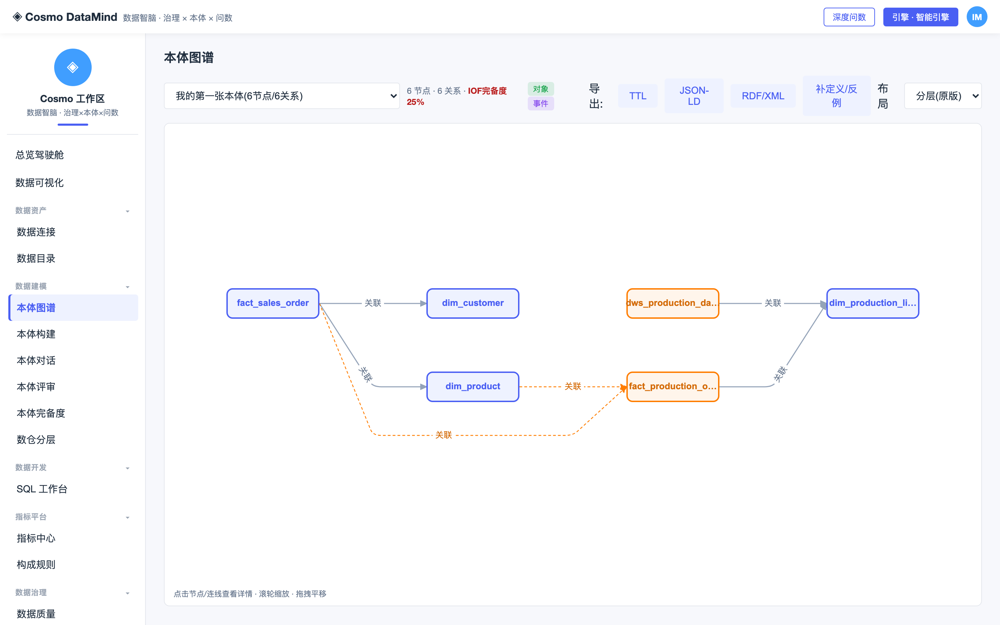
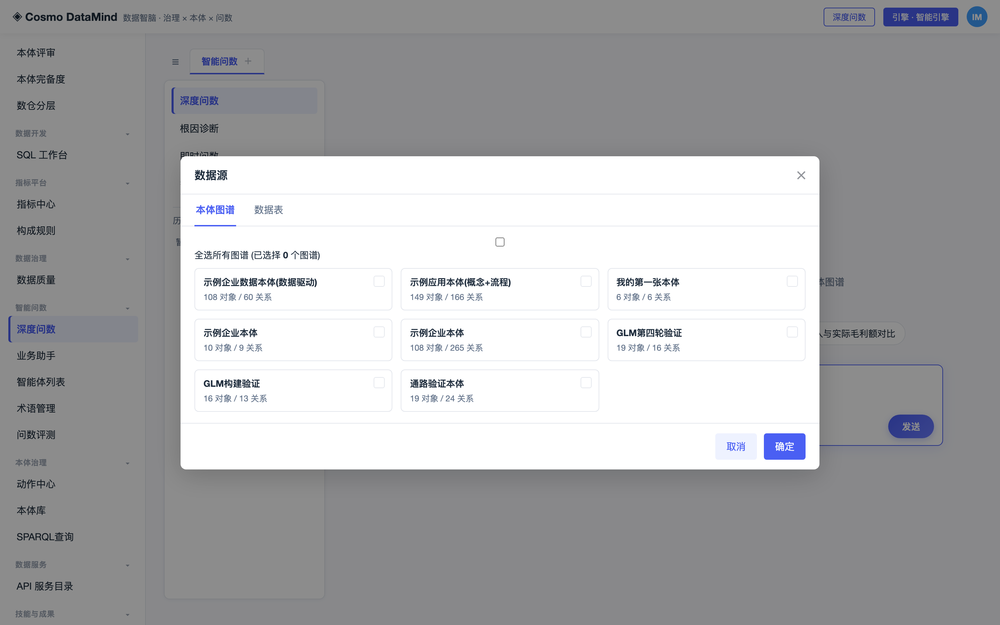
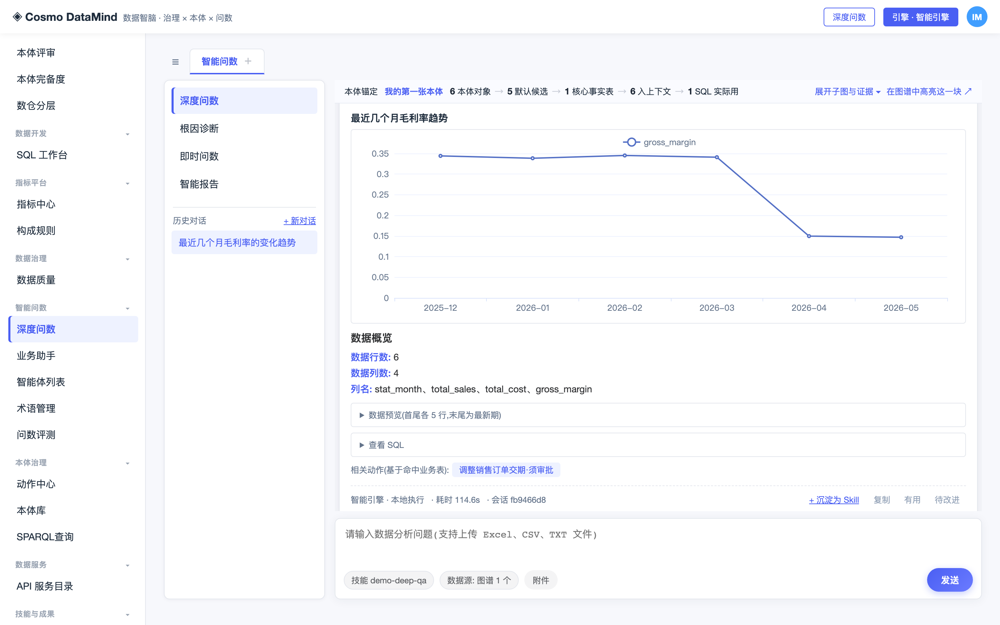
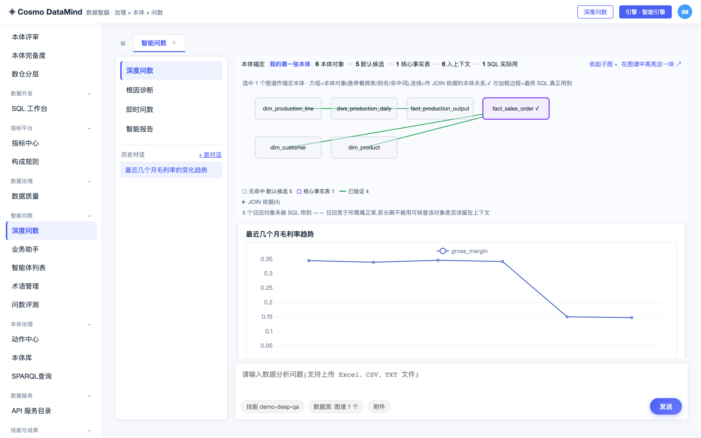
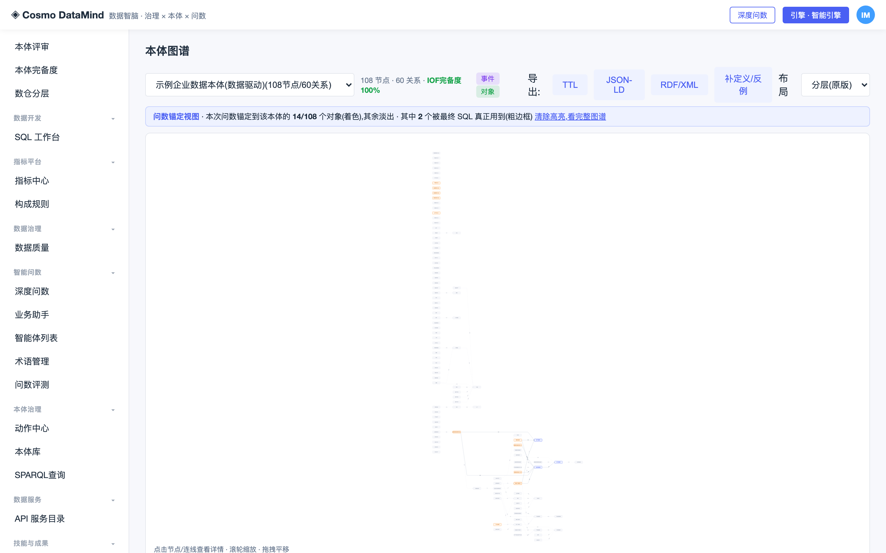

# 快速入门

从零到「问出一个数」,约 15 分钟。全程只需**一个 OpenAI 兼容的 API Key**,无需上游本体引擎。

本文所有命令与输出均经实测。示例库为合成数据,其中的业务现象是刻意构造的,可稳定复现。

---

## 0. 先搞清三个概念

看文档时最容易卡住的三处,先说清楚:

**① 上游本体引擎是什么?**
一个**可选**的外部组件（由 `DATAMIND_ENGINE_DIR` 指向）,提供多智能体运行时与会话式构建技能。
**它不随本仓发布**。没有它,下面全部步骤照样能跑完——本文就是不接引擎的路径。
接了它才多出:会话式建本体、对话改本体(apply/undo)、内置构建技能库。

**② 那 LLM 从哪来?**
本仓自带 OpenAI 兼容驱动。配好三个环境变量即可,与上游引擎无关:

```bash
export DATAMIND_LLM_BASE=...    # 端点前缀,到 /v4 或 /v1 为止,不含 /chat/completions
export DATAMIND_LLM_KEY=...     # API Key
export DATAMIND_LLM_MODEL=...   # 模型名
export CLAW_DRIVER=openai       # 关键:告诉系统优先用这个驱动
```

`CLAW_DRIVER=openai` 常被漏掉——不设的话系统会按默认顺序找其他驱动,表现为「配了 Key 却没反应」。

**③ 有 LLM 广撒网提议吗?**
有。本体构建走「**LLM 广撒网提议 → 真实数据裁决 → 人工定夺**」:模型可以大胆提议关系,
但 `verified` 只能由数据裁定（取值重叠 ∧ 父键近唯一 ∧ 列名词根相容）,无据一律降 `candidate`。
不配 LLM 时,构建自动降级为纯数据驱动（只找得到数据能自证的关系,提议环节没有）。

---

## 1. 安装

```bash
git clone <repo-url> && cd cosmo-datamind
python3 -m venv .venv && source .venv/bin/activate
pip install -r requirements.txt
```

## 2. 造一个示例数据库

```bash
sqlite3 demo.db < examples/sample_db.sql
```

得到 6 张表（3 张维表 + 2 张事实表 + 1 张汇总表）、约 2200 行,覆盖 2025-12 至 2026-05 半年数据。

这份示例数据是**刻意设计**的,埋了三个真实数仓里常见的坑:

| 埋的坑 | 为什么埋 |
|---|---|
| 表间**没有声明外键** | 关系只能靠取值重叠自证——这正是半自动构建要解决的问题 |
| 同一实体列名不一致(`line_id` vs `prod_line_id`) | 考验关系判定 |
| `prod_id` 与 `output_id` 都是从 1 开始的自增键 | **值域天然 100% 重合**,考验反造假闸能否识破巧合 |
| 2026-04 起成本抬升 | 埋一个能被问出来的业务现象 |

## 3. 配模型并启动

以智谱 GLM 为例（换 DeepSeek / Qwen / OpenAI / vLLM 自建只改前三个变量）:

```bash
export DATAMIND_DB=$PWD/demo.db
export DATAMIND_LLM_BASE=https://open.bigmodel.cn/api/coding/paas/v4
export DATAMIND_LLM_KEY=<你的-key>
export DATAMIND_LLM_MODEL=glm-4.5
export CLAW_DRIVER=openai
python3 server.py
```

打开 http://127.0.0.1:8092 。**先确认模型接上了**:

```bash
curl -s http://127.0.0.1:8092/api/ont/runtimes
# 期望 "current_ready": true
# 若为 false,同一份响应里的 hint 会写明缺什么 —— 不会静默假装可用
```

> **推理型模型要放宽超时。** glm-4.5、o 系列这类模型在"思考"上就要 60 秒以上。
> 默认单轮超时 180 秒;若你的模型更慢,`export DATAMIND_LLM_TIMEOUT=300`。
> 给小了的现象是:执行记录里 `llm_plan` 一栏显示「返回 42 字符」然后回退模板——
> 那是超时截断,不是模型不会答。
> 同理 `DATAMIND_LLM_MAX_TOKENS`（默认 16384）:思考占用计入该额度,给小了正文会被挤没。

## 4. 建一张属于你自己数据的本体

**内置示例本体是给内置示例库用的**,换了你自己的库就对不上——必须先建自己的。

```bash
python3 quick_build.py demo.db workdir/built_myfirst.json 我的第一张本体
```

输出:

```
[quick_build] 6 张表
[quick_build] 关系 6 条 (verified 4)
```

**6 条关系里只有 4 条被判 verified**,这不是缺陷,是反造假在工作。看被降级的那两条:

```
dim_product → fact_production_output   candidate
  prod_id→fact_production_output.output_id 重叠100% 但键名词根不一致,疑为自增键值域巧合,送审
```

`prod_id` 与 `output_id` 都是 1,2,3…,值域 100% 重合纯属巧合。
**只看重叠率会把它判成真关系**;键名词根这道闸把它拦了下来,降为候选交人审。

刷新页面,在「本体图谱」的下拉里选中「我的第一张本体」:



绿色实线是已验证关系,灰色虚线是候选关系。右上角的 IOF 完备度 25% 也是实情——
`quick_build` 只从数据推断结构,不产出定义与反例,这部分要靠后续人工或大模型补齐。

## 5. 问一个数

进「深度问数」。**第一件事:点问数框下方的「数据源」,在「本体图谱」页选中刚建的那张本体。**



不选的话系统用内置示例本体,而它描述的是另一个库——SQL 会查到不存在的列。
选中后,对话区顶部的**锚定条**会显示:

```
本体锚定  我的第一张本体  6 本体对象 → 5 默认候选 → 1 核心事实表 → 6 入上下文 → 1 SQL 实际用
```

中间一节是「默认候选」而不是「问句命中」——因为 `quick_build` 出的对象只有英文表名、
没有中文名与别名,中文问句一个词都命中不了,系统只好把候选表全给上下文。
**这正是本体该被「养」的地方**:到「本体对话」页用一句话给对象加中文业务别名,
再问同一个问题,这一节就会变成「问句命中」。别名怎么挑见
[LLM 建本体与问数教程](docs/TUTORIAL-llm-build-qa.md) 第四节。

输入:

> 最近几个月毛利率的变化趋势

实测结果（GLM-4.5,约 1~2 分钟）:

| 月份 | 毛利率 % |
|---|---|
| 2025-12 | 34.40 |
| 2026-01 | 33.85 |
| 2026-02 | 34.52 |
| 2026-03 | 34.10 |
| **2026-04** | **14.97** |
| **2026-05** | **14.71** |



4 月起断崖下滑——正是第 2 步埋进数据里的那个现象。

**执行记录里有时会出现这样一行**（取决于模型这次生成了什么 SQL,不是每次都有）:

```
✗ ontology_gate  [3] 口径拦截:JOIN 键 dim_product.prod_line_id=dim_production_line.line_id 不在已验证关系上
```

模型想把「产品」与「产线」直接关联起来,被口径门禁拦下。原因是本体里**没有**这条关系:
示例库中产品表的 `prod_line_id` 与产线表的 `line_id` 列名不同,`quick_build` 未能据此确立关系,
而门禁只放行落在已验证关系上的 JOIN 键。

**这是反造假从建本体贯通到问数的一条链**:建模阶段没被数据证实的关联,
问数阶段就不许模型凭空用上。被降为 `candidate` 的关系同理——门禁只认 `verified` 与 `asserted`。

这条拦截**能否出现取决于模型选了哪条 JOIN 路径**,同一个问题多问几次未必每次都触发:
换用两端同名的键（如两表都叫 `prod_id`）时门禁会放行——列名本身即口径,不属臆造。
门禁拦的不是"得到答案",而是**没有本体依据的那条路**。

## 6. 看清楚「本体是怎么被用的」

点锚定条上的 **「展开子图与证据」**:

- **命中证据** —— 哪个词把哪张表钓出来的(补了中文名/别名后才有内容;
  刚建好的本体这里通常是空的,说明召回是"默认给"而不是"命中给")
- **JOIN 依据** —— 每条键的来源与状态,存疑的标「已降级」
- **子图** —— ✓ 与加粗边框标出最终 SQL 真正用到的对象



点 **「在图谱中高亮这一块」** → 跳到本体图谱页,本次用到的对象着色、其余淡出,
顶部写明「本次问数锚定到该本体的 N/M 个对象」。这回答的是「**用到的是本体的哪一块**」。

下图是在内置示例本体（108 个对象）上的效果,对比更明显——本次问数只用到其中 14 个:



本教程建的本体只有 6 个对象且全部被召回,高亮后看不出淡出效果,属正常。

---

## 常见卡点

| 现象 | 原因 | 处理 |
|---|---|---|
| `current_ready` 为 false | `DATAMIND_LLM_BASE` 或 `_KEY` 没配上 | 看响应里的 `hint`;端点写到 `/v4`、`/v1` 为止 |
| 配了 Key 但走模板兜底 | 漏了 `CLAW_DRIVER=openai` | 补上 |
| `llm_plan` 显示「返回 42 字符」 | 推理型模型超时被截断 | 调大 `DATAMIND_LLM_TIMEOUT` |
| SQL 报 `no such column` | 问数用的是内置示例本体,不是你的库 | 在「数据源 → 本体图谱」里选中自己的本体 |
| 问数出 0 图且无 LLM | 未配模型时模板只对内置示例库有效 | 配模型,或改用内置示例库体验 |
| 关系大量是 `candidate` | 反造假在工作,不是故障 | 到「本体评审」逐条人审,通过后成 `asserted` |

## 不配 LLM 能做什么

完全不配模型也能跑,只是能力不同:

| 能力 | 不配 LLM | 配了 LLM |
|---|---|---|
| 浏览本体 / 指标 / 数据质量 / 术语 / 动作中心 | ✅ | ✅ |
| SQL 工作台（只读）/ SPARQL / 标准导出 | ✅ | ✅ |
| 建本体 | ✅ 纯数据驱动（无提议环节） | ✅ LLM 广撒网提议 + 数据裁决 |
| 本体体检（CQ / 漂移 / 健康度 / 兼容 / 模块化） | ✅ 全部确定性计算 | ✅ 同左 |
| 深度问数 | ⚠️ 仅内置示例库（模板是为它写的） | ✅ 任意库 |

## 接上游引擎（可选）

若你另有兼容的引擎目录（提供 `engine/agent_runtime.py` 与 `web/skills_seed/`）:

```bash
export DATAMIND_ENGINE_DIR=/path/to/ontology-engine
```

多出来的能力:会话式建本体、对话改本体(apply/undo)、内置构建技能库,
以及 `hermes` / `claude-code` / `openclaw` 等运行时。

**关于 OpenClaw**:系统调用的是**本机已安装的 `openclaw` 命令行**
（会话落在 `~/.openclaw/`）。OpenClaw 自己连哪个网关(`wss://...` + Token)
是在 OpenClaw 客户端里配的,本系统不直接连网关——它只负责调起本机 CLI。
所以顺序是:先在 OpenClaw 里把网关配通 → 再设 `DATAMIND_ENGINE_DIR` 与 `CLAW_DRIVER=openclaw`。

---

下一步:`README.md` 有完整能力清单,`specs/` 下是逐条决策记录（为什么这样设计、代价是什么）。
