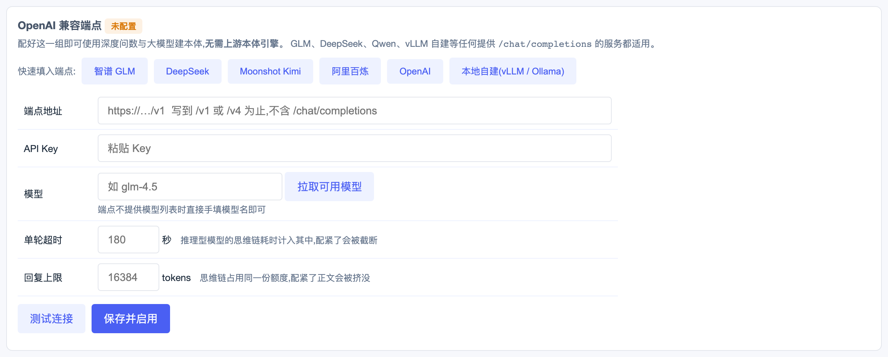
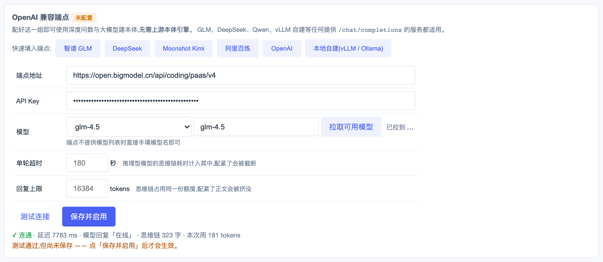
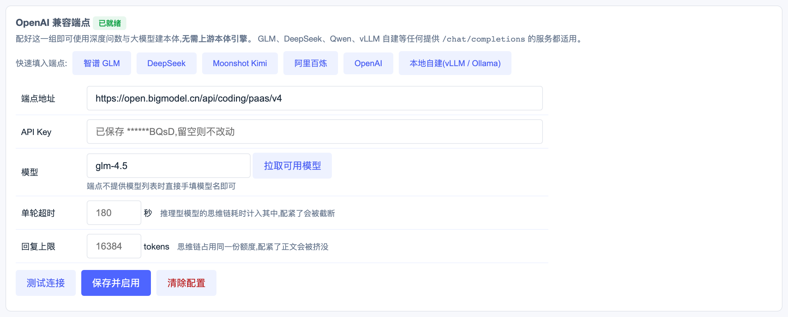

# Cosmo DataMind

**数据治理 × 工业本体 × 深度问数** 的一体化原型:把杂乱的业务库,建成一张**带类型、带口径、带证据**的工业本体图谱,并让人和 Agent 都能可信地问数、诊断、执行动作。

Apache-2.0 · Python + Flask + 原生 JS(无前端构建步骤)· 单端口本地运行

---

## 它解决什么问题

大模型接入企业数据时,常见的不是"模型不够强",而是**语义对不上**:

- 同一个"工单号",6 张表里 5 种列名,表间关系一条都没写进库;
- "直通率"和"良率"被混用,答案给了数却给不出口径;
- 跨表 JOIN 全靠猜,错了也没人发现。

Cosmo DataMind 先用模型批量提出候选项，再用数据库约束和取值样本验证连接关系，由人工确认业务语义。系统记录每条关系的验证依据和状态，并在适用时按 BFO/IOF 官方术语与类别约束映射上层关系；无法确认的关系保留为本地属性。

## 核心特性

| 能力 | 说明 |
|---|---|
| **半自动本体构建** | CQ/技能方法 → 候选提议 → 语义复核 → 数据验证 → 确定性验收检查 → 人工确认。`verified` 至少要求声明外键，或取值重叠(≥60%)、父键唯一、命名依据与方向检查同时成立；依据不足时保留为 `candidate` |
| **证据分层** | 每条关系带状态 `verified` / `asserted` / `candidate` / `gap`;图上线型即语义,一眼看出哪条敢用 |
| **深度问数** | 自然语言 → 本体定位对象与口径 → 生成 SQL → **只读执行** → 带出处作答;同屏给出指标口径卡(计算口径/数据出处/血缘) |
| **本体锚定可视化** | 选中哪套本体、凭哪个词命中哪张表、沿哪条关系扩展、最终 SQL 真正用了谁 —— 对话区常驻锚定条画出完整链路,可一键跳到图谱高亮「用到的是本体的哪一块」 |
| **口径校验** | SQL 执行前校验:表须在本体白名单内,JOIN 键须落在已验证关系上,越界即拦 |
| **根因诊断** | 沿本体关系两跳召回,输出受本体边界约束的根因与检查清单;实体未命中即**如实拒答**,不作无锚定生成 |
| **动作层** | 类型化参数 + 风险分级:低风险直接形成动作记录、高风险人审批,决策全程留痕。当前为 `decision_capture`，不写回业务系统；经 MCP 对外时,**发起动作是唯一写工具,审批不开放** |
| **标准导出** | OWL2 / RDF / SHACL / SKOS / JSON-LD,并提供 SPARQL 端点 |
| **问数评测** | 参考问题集 × 三组同题对照(无检索增强 / 图谱增强 / 本体增强),度量正确率、出处引用率与口径拦截数 |
| **本体体检** | 能力核验(CQ)、数据源漂移、图结构检查(孤岛/自反/重复边/超级节点)、向后兼容影响面、模块化建议 —— 全部确定性计算,不调 LLM |

## 从这里开始

第一次上手请看 **[QUICKSTART.md](QUICKSTART.md)** —— 建示例库 → 建本体 → 问出一个数,
约 15 分钟,只需一个 OpenAI 兼容 API Key,不需要上游引擎。

## 安装与部署

以下命令序列均经全新克隆 + 干净 venv 实测。

### 1. 安装

```bash
git clone <repo-url>
cd cosmo-datamind
python3 -m venv .venv && source .venv/bin/activate
pip install -r requirements.txt
```

### 2. 配置(可选)

```bash
cp .env.example .env               # 按需填写;全部留空也能启动
export DATAMIND_DB=/path/to/your.db          # 只读 SQLite 数据源
export DATAMIND_WORKDIR=/path/to/datamind-workdir     # 运行态本体/上传/审计目录（可选）
export DATAMIND_ENGINE_DIR=/path/to/ontology-engine   # 上游引擎(可选)
```

两者都不设也能起服务:图谱页直接浏览内置示例本体(108 对象 / 60 关系),
需要数据库的端点会在响应里如实标注「数据库不可用」,不会静默失败。

### 3. 启动

```bash
python3 server.py                  # 前台运行 → http://127.0.0.1:8092
# 或
./start.sh                         # 后台运行,日志在 workdir/server.log
```

停止:`kill $(lsof -ti :8092)`

### 4. 验证与测试

```bash
curl http://127.0.0.1:8092/api/overview      # KPI 概览(无库时含 warning 字段)
python3 test_all.py                          # 系统级回归(源码定义 553 个检查点;需服务已启动)
```

### 5. 跑通 demo(五分钟看完主链路)

内置示例本体(108 对象 / 60 关系)可直接浏览。问数、数据分析与关系检验需要把
`DATAMIND_DB` 指向可读的 SQLite 数据库；可用 `examples/sample_db.sql` 创建最小示例库。

**① 看本体** → 左侧「本体图谱」。点节点看绑表与属性,点连线看关系证据
(子键→父键、取值重叠率、证据来源)。

线型表示关系状态(全站统一,本体图谱与问数锚定子图共用同一套):
**灰实线**=`verified`(数据裁决过)、**靛蓝虚线**=`asserted`(人审断言)、
**紫点线**=`inferred`(推理得出)与两跳可达路径、**橙虚线**=`candidate`(待取证)与 `gap`(证据不足)。
**内置示例本体 60 条关系当前均标记为 `verified`（表示连接关系经过数据验证，不代表业务语义已获专家确认）**——想查看混合状态,
在图谱下拉里换到构建产物(如 `built_*`,含 candidate)或上游引擎产物(含 gap)。

**② 问一个数** → 「深度问数」,点示例问题或自己输入。**每次提问都真跑一遍**
(不吃缓存,想看以前的答案去左侧「历史对话」)。看对话区顶部常驻的**锚定条**:

```
本体锚定  示例企业数据本体  108 本体对象 → 8 问句命中 → 4 沿关系扩展 → 12 入上下文 → 1 SQL 实际用
```

展开可见锚定子图、命中证据(哪个词钓出哪张表)、JOIN 依据及每条键的来源;
点「在图谱中高亮这一块」会跳到图谱页,把本次用到的对象着色、其余淡出。

**③ 换一套本体再问** → 问数框下方「数据源 → 本体图谱」选中另一套(如构建产物),
再问同一个问题。锚定条上的本体名与召回集会随之改变——**选中的图谱就是锚定源**,
不是过滤器:召回、JOIN 依据、口径校验、使用度埋点全部改用这套本体。

三种情况界面都会说清楚:
- 选中本体**有绑表对象** → 正常锚定,链路条显示该本体的规模与各级留存
- **完全没有绑表对象**(如纯概念本体)→ 生不出 SQL,如实回退示例本体并在条上标明原因
- **部分有部分没有**(混合本体)→ 只用有绑表的那部分,链路条上的中间节
  会从「问句命中」变成「默认候选」等,取决于问句是否命中

**④ 建一套本体** → 「本体构建」选数据源直接构建(纯数据驱动,无需 LLM);
或接引擎后用会话式构建。产物出现在图谱列表里,可立刻拿去问数(见 ③)。

想验证「本体到底有没有用」:进「问数评测」跑三组同题对照(无检索增强 / 图谱增强 / 本体增强)。

### 6. 生产部署(可选)

内置的 Flask 开发服务器仅供本地使用。对外提供服务时用 WSGI 服务器 + 反向代理:

```bash
pip install gunicorn
gunicorn -w 1 -k gthread --threads 4 -b 127.0.0.1:8092 server:app
```

再由 Nginx 等反代承担 TLS 与鉴权——本服务自身不含用户体系,见 [SECURITY.md](SECURITY.md)。

## 运行形态:两档

本系统分**独立运行**与**接引擎运行**两档,差别只在需要大模型的环节:

| 功能 | 独立运行(默认) | 接上游引擎 |
|---|---|---|
| 图谱浏览 / 指标 / 数据质量 / 术语 / 动作中心 | ✅ | ✅ |
| SQL 工作台(只读) / SPARQL / 标准导出 | ✅ | ✅ |
| 深度问数 | ✅ 模板兜底,出真实数据 | ✅ LLM 生成 SQL 计划 |
| 本体构建 | ✅ 纯数据驱动(`quick_build`) | ✅ LLM 基于数据库和可解析文档提议 + 确定性验证 |
| 对话式本体编辑(apply/undo) | ❌ 需要引擎 | ✅ |
| 内置构建技能库 | ✅ 本仓 `ontology-semi-auto` | ✅ 本仓 + 上游技能 |

上游本体引擎是**可选组件,不随本仓发布**——本仓开源范围仅 Cosmo DataMind 本体。
若你拥有兼容的引擎目录(提供 `engine/agent_runtime.py` 多运行时抽象与 `web/skills_seed/` 构建技能),
一个环境变量即可接入:

```bash
export DATAMIND_ENGINE_DIR=/path/to/ontology-engine
```

**未配置时不会报错**——相关端点如实返回"无可用运行时",功能自动降级并在界面标注,
不会静默失败,也不会用兜底数据冒充真实结果。

## 引擎设置

深度问数与大模型建本体都要接一个大模型。**接任意 OpenAI 兼容端点即可,无需上游本体引擎**——
GLM、DeepSeek、Qwen、Moonshot、以及 vLLM / Ollama 自建服务都适用。

两种配法:界面配（推荐,可先测后存）、环境变量配（适合容器与 CI）。

### 在界面里配（推荐）

打开「运维管理 → 引擎设置」,第一张卡片就是 **OpenAI 兼容端点**。以智谱 GLM 为例:



**第一步,填端点地址。** 点「智谱 GLM」按钮一键填入,或手工输入。

> 端点地址写到 `/v1` 或 `/v4` 为止,**不要带 `/chat/completions`**——这是最常见的填错。
> 系统会在保存时校验协议头,`ftp://` 之类会被直接拒绝。

**第二步,粘贴 API Key。** 输入框为密码类型;保存后只回显掩码（如 `******BQsD`）,
不提供明文回读。已保存过 Key 时,该框留空表示不改动,便于只改模型名。

**第三步,选模型。** 点「拉取可用模型」会向端点的 `/models` 接口取一次真实列表,
拉到后左侧出现下拉框,选中即回填到右侧输入框。部分服务不提供该接口,
直接在输入框手填模型名即可——界面会如实告诉你拉取失败。

**第四步,先测后存。** 点「测试连接」用**你正在填的这份配置**发一次最小请求:



返回真实延迟、模型的实际回复、思维链字数与本次消耗。这几个数字都有用途:

| 返回项 | 怎么用 |
|---|---|
| 延迟 | 判断单轮超时该配多大。问数的规划提示词比测试长得多,实际耗时通常是它的十倍以上 |
| 思维链字数 | 非零说明是推理型模型,回复上限要留足 |
| 正文为空但思维链很长 | 额度被推理占满,界面会直接提示调大回复上限 |

失败时回传上游的原始报错（如 `HTTP 401 令牌已过期或验证不正确`）,
其中若含 Key 会被掩码后再显示。

**第五步,保存并启用。**



保存后状态转为「已就绪」,并**自动把当前运行时切到该端点**——
配好了端点却忘记切换,是「配了没反应」的头号原因,故由系统代劳并在提示中说明。

### 两个进阶参数

| 参数 | 默认 | 何时要改 |
|---|---|---|
| 单轮超时 | 180 秒 | 推理型模型的思维链耗时计入其中。配紧了的现象是执行记录中 `llm_plan` 显示「返回几十字符」随后回退模板——那是被截断,不是模型不会作答 |
| 回复上限 | 16384 tokens | 思维链占用同一份额度。配紧了正文会被挤没,表现同上 |

### 用环境变量配

容器化部署或不希望密钥落盘时用这种方式:

```bash
export DATAMIND_LLM_BASE=https://open.bigmodel.cn/api/coding/paas/v4
export DATAMIND_LLM_KEY=<your-key>
export DATAMIND_LLM_MODEL=glm-4.5
export CLAW_DRIVER=openai            # 必须,否则不会优先使用该端点
export DATAMIND_LLM_TIMEOUT=180      # 可选
export DATAMIND_LLM_MAX_TOKENS=16384 # 可选
python3 server.py
```

**环境变量优先于界面配置**:由运维注入的项在界面上会置灰并注明原因,避免部署配置被误改。

自检:

```bash
curl -s http://127.0.0.1:8092/api/ont/runtimes
# 关注 "current_ready": true;为 false 时同一份响应里的 hint 会写明缺什么
```

端点或 Key 缺任一项,该驱动都不会注册——系统据实报「无可用运行时」并退回内置模板,
不会接受配置却在调用时才失败。

### 其他配置项

| 变量 | 作用 |
|---|---|
| `DATAMIND_DB` | 只读数据源路径 |
| `DATAMIND_WORKDIR` | 运行态本体、上传库、审计与自定义技能目录（默认 `./workdir`） |
| `DATAMIND_ENGINE_DIR` | 上游本体引擎目录（可选,见下节） |
| `DATAMIND_HOST` / `DATAMIND_PORT` | 默认 `127.0.0.1:8092` |
| `DATAMIND_MAX_REQUEST_BYTES` | HTTP 请求体上限，覆盖文件上传与聊天附件；默认 25 MiB |
| `OPENAI_API_KEY` 等 | 各家密钥,供接入上游本体引擎后的 CLI 型运行时继承 |

完整清单见 [`.env.example`](.env.example),部署细节见 [INSTALL.md](INSTALL.md)。

### 进阶教程

[接大模型 → 会话式建本体 → 基于本体问数](docs/TUTORIAL-llm-build-qa.md) ——
GLM-5.2 与 OpenAI 的完整配置、用自然语言建一张带中文名的本体、再拿它问出一个数,
含错误关系控制在两个环节如何生效的实测记录。

## 安全

默认**只监听本机**,不含用户体系与鉴权。请勿在无反向代理鉴权的情况下暴露到公网。
已内置的防护(只读三重防写、CSRF 守卫、路径穿越校验、标识符消毒、SPARQL 禁外呼)
与已知边界,见 [SECURITY.md](SECURITY.md)。

## 建模规则文档

`specs/` 下是完整的**规约驱动开发(SDD)**记录——不是事后补的说明,而是开发时的决策依据:

- `specs/decisions/` — DR-001…DR-050 决策记录,每篇写清背景、选项、取舍与代价
- `specs/iterations/` — IR-001…IR-011 迭代记录,含验收标准与实测结果
- `specs/map.md` — 入口索引

半自动构建方法的核心取舍（为何数据验证优先于模型判断、为何人工确认产生 `asserted`、
如何执行确定性验收检查）记在 `DR-002`、`DR-011` 与 `DR-050`;执行顺序见
`docs/pipelines/ontology_build.yaml`。

## 测试

```bash
# 单元层:离线、秒级,不需起服务(确定性模块的隔离测试)
python3 -m venv .venv && .venv/bin/pip install -r requirements-dev.txt
.venv/bin/python -m pytest tests/ -q      # 单测 + 文档计数自检(2026-08-29:284 项测试)
.venv/bin/coverage run -m pytest tests/ -q && .venv/bin/coverage report   # 覆盖率低于81.0%时失败

# 集成层:需先起服务
.venv/bin/python server.py &            # 先起服务
.venv/bin/python test_all.py            # 系统级回归(源码定义 553 个检查点)
.venv/bin/python test_ui.py             # 全 UI 走查:页面渲染 + 子 UI 交互(需 playwright)
.venv/bin/python test_ui_ops.py         # UI 逐步实操:切引擎/建本体/对话改本体/审计/问数/选本体锚定
```

两层分工:单元层测确定性模块的边界与纯函数(离线可跑),集成层测端到端契约与安全约束。
套件覆盖路由可达性、只读约束、CSRF、路径穿越、证据分层一致性、编辑回放等。
**未配置引擎时,依赖引擎的用例会失败**——这是如实反映能力边界,不是缺陷。

## 贡献

欢迎 issue 与 PR。改动请附上对应的 DR/IR 说明,并保证 `test_all.py` 不出现新的失败项。
安全问题请勿公开提交,见 [SECURITY.md](SECURITY.md)。

## 许可证

[Apache-2.0](LICENSE)。第三方组件署名见 [NOTICE](NOTICE)。
