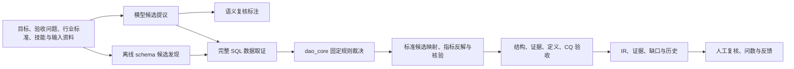

# COSMO DataMind 算法、系统与工程审计

日期：2026-09-07。范围：本仓源码、随仓合成验证库、临时运行目录和本地浏览器。
修改已落实到工作区；未改写用户已有本体、业务数据或模型配置，未提交或发布。

## 系统和算法理解

系统由 Flask 单进程服务、原生 JavaScript UI、JSON 本体 IR、只读 SQLite 数据执行和可选模型运行时组成。
`server.py` 仍承担大量编排，`bp_*` 分出部分路由；`srv_context`、`dao_core`、`build_quality` 等提供共享原语。
本体不是由模型直接生成一个可信结果：模型提供候选，数据和人工分别承担连接验证和业务语义判断。



关键区别是 `verified` 只证明当前数据上的连接验证，`asserted` 表示人工关系确认，`grounding_status` 表示上层本体映射情况。
指标的 `certified` 同样只能由人授予；数据验证不能证明定义、因果或业务口径在所有情境下成立。
二进制附件未解析时只登记来源；本仓没有完整 OWL DL 推理器，不能将结构体检称为完整逻辑一致性证明。

原架构有合理基础：单一裁决核、候选保留、语义争议分轴、固定标准资产、指标契约和人工反馈。
本轮主要修复的是这些约束在具体实现中的缺口，而没有更换模型或未经评测地调整阈值。

## 已复现并修复的问题

下表是缺陷族，不把参数化测试数量计作漏洞数量。

| 范围 | 修改前的触发与影响 | 修改后 |
|---|---|---|
| 值域截断 | LLM 分支只取前 8,000 个 distinct，离线分支取前 20,000 个；可能把 40% 重叠判成 100%，也可能漏掉父表后段的正确匹配 | SQL 内完整集合聚合，记录去重数、匹配数和完整性；两分支共用原语 |
| 复合键与声明 FK | 复合 PK 首列被当唯一，复合 FK 被拆成单列 verified；声明 FK 含孤儿仍放行 | 保持列序与联合元组，检查真实唯一性与引用完整性 |
| 验收证据 | NaN/Inf、超范围百分比、错配/重复联合列和备注中的 schema 字样可能绕过验收 | 百分比有限且在范围内，逐列验证，备注不授予证据特权 |
| 构建资源与文件 | 输出可覆盖输入数据库；URI 元字符可打开另一文件；异常快照不释放；宽 PK 扩大自动枚举 | 拒绝源文件及硬链接别名，转义 URI，finally 关闭，快照/60秒预算/缓存及组合上限 |
| 指标生命周期 | 新核验失败仍保留旧 verified；deprecated 可被重新启用；另一个公式的证据覆盖已确认公式 | 机器状态跟随最新证据，人工决定保留且证据绑定原口径 |
| 指标参照与比较 | 参照只存结论导致无法重放；浮点取整把不同结果视为一致；维度使用容差；截断结果可能一致 | 保存参照输入，十进制比较，维度精确匹配，拒绝截断/非法数值；MIN/MAX 文本按精确值比较 |
| 指标 SQL 与并发 | 原始契约过滤算子未重验；参照维度缺列被 SQLite 当字符串；读改写锁只包写入 | 编译重验，分组列查目录；人工状态完整加锁，重核验检测并发变更并返回409 |
| 指标数据快照 | 主 SQL 与参照使用不同连接；并发更新可使两个时点的值巧合相等，任一时点实际均不一致 | 表结构、主查询、参照和重分组共享只读事务与时间预算 |
| 离线问数 | “客户数量”落入默认销售收入模板；沉淀技能可越过显式选表；带引号/CTE绕过仅选图谱范围 | 正确编译单表记录计数，未覆盖意图明确返回；同步/SSE执行前检查真实读取表并取图谱/选表交集 |
| CSRF / Host | null、畸形源或不同 scheme 未完整拒绝；任意 Host 支持 DNS rebinding | 完整源比较、默认本地主机白名单、显式 TLS 反代源，拒绝伪造 forwarded 授权 |
| SSRF | API 重定向和校验后的再次 DNS 解析可绕过目标检查 | 逐跳验证、连接时固定已校验 IP、保留 TLS 校验并禁用环境代理 |
| SQL 边界 | 注释中的引号隐藏分号；SELECT INTO/OUTFILE/DUMPFILE 被当只读 | 共享词法掩码区分代码、字面量和注释；拒绝写入及方言歧义语法 |
| 请求与 API 导入 | 请求行不计总头时限；非对象 JSON 引起500；清洗列名丢值/碰撞，刷新失败丢旧表 | 请求行总预算，非对象400，原列映射，DDL+插入事务回滚 |
| 构建交互 | SSE 提前 EOF 被当结束且清空诉求；晚到的底本/详情响应覆盖当前选择 | done 终态要求，120秒空闲和1MiB事件限额，错误恢复、序号校验、失败底本阻断提交 |
| UI 与窄屏 | 多轮结果 DOM id 重复，动态字段未统一转义，移动端本体列表撑出多屏 | 唯一预览 id、外部字段转义、图谱随宽度缩放、移动列表280px上限和键盘访问 |

SQLite 未知双引号标识符被当作字符串的行为有官方说明；因此“SQL 执行成功”不能独立充当列存在的证据。[SQLite 官方说明](https://www.sqlite.org/quirks.html#double_quoted_string_literals_are_accepted)
地址验证与跨源检查的设计参考 OWASP 原始建议，具体修复由本地失败用例验证。[SSRF 防护](https://cheatsheetseries.owasp.org/cheatsheets/Server_Side_Request_Forgery_Prevention_Cheat_Sheet.html)、[CSRF 防护](https://cheatsheetseries.owasp.org/cheatsheets/Cross-Site_Request_Forgery_Prevention_Cheat_Sheet.html)

## 算法对照结果

使用随仓 `examples/demo_metrics.db` 的 108 表合成制造数据。
对照旧 `quick_build` 与修复后的取证实现，共用当前裁决核，其余数据一致；输出全部在临时目录。

| 项目 | 旧取证实现 | 修复后 |
|---|---:|---:|
| 关系总数 | 261 | 261 |
| verified | 199 | 195 |
| candidate | 62 | 66 |
| 取证异常 | 0 | 0 |
| 单次耗时 | 0.1557秒 | 0.1705秒 |

四条降级关系为 `ar_aging → invoice`、`invoice → delivery`、`material_consumption → production_order`、`return → sales_order`。
分别发现 563、185、6,942、151 行孤儿引用；其余关系的状态和重叠率未变。
这是错误验证结论的纠正，不是召回率提高；单次耗时不构成性能基准，未据此宣称大库加速。

## SDD / TDD 改进

- `DR-056` 记录证据、状态、资源、请求与 UI 约束，`IR-014` 记录本轮交付。
- `specs/acceptance.json` 建立“要求 → 行为测试”映射，元测试校验链接仍然有效。
- 新测试先复现失败，再做修复；算法首批24个失败、指标首批17个失败、UI首批10个失败均有实际 RED 记录。
- pytest 在导入服务模块前隔离目录与模型环境；`scripts/check.py` 只复制已提交种子，清理临时服务和数据。
- 验收进程最长360秒，浏览器上下文和驱动退出各15秒；清理只针对本轮子进程。修复原浏览器关闭等待不结束的问题。
- CI 分单元/前端行为、HTTP/十轮变序、真实浏览器三类任务，统一调用同一检查入口并保存日志。
- 补齐已有 Mypy 错误，保留覆盖率门槛，新增取证原语进入覆盖范围；没有通过降低覆盖率门槛来使检查通过。

复现命令：

```bash
python -m pip install --upgrade pip==26.2
python -m pip install -r requirements-dev.txt -r requirements-ui.txt
python -m playwright install chromium
python scripts/check.py --suite all
```

Node.js 用于执行实际前端函数的行为测试。
CI 工作流已更新，本地会执行同等命令；本轮没有向远端推送，不能据此声称 GitHub Actions 已运行。

## 最终验收记录

最终分层验收由同一 `scripts/check.py` 的三个 suite 分别执行，全部退出码为0。
原始日志、退出码、日志SHA256、算法对照和依赖版本已归档到[验收证据目录](2026-09-07-evidence/summary.json)。

| 验收层 | 最终结果 |
|---|---|
| 单元、规格映射与实际前端函数行为 | 708通过，0失败、0跳过 |
| 配置中的模块覆盖率 | 87.5%，门槛81%保持不变；包含分支，不代表整站/整个server.py覆盖率 |
| Ruff / Mypy / diff空白检查 | 通过 |
| HTTP集成 | 551通过、0失败、8项上游引擎未提供的条件跳过 |
| 十轮变序回归 | 10/10通过 |
| 全站UI走查 | 64通过、0失败 |
| UI实操 | 50通过、0失败、3项在线端点未配置的条件跳过 |
| 构建浏览器专项 | 10组通过、0页面错误 |
| 依赖兼容 | pip check通过；升级环境中完成上述检查 |

初始单元基线为534通过、1跳过；最终新增/启用的行为检查并非同等数量的独立漏洞。
首次十轮变序9/10，真实发现离线客户计数错答，已补测试修复。
综合验收还暴露了指标跨快照伪一致、仅选图谱的带引号/CTE绕过；均以失败用例复现后修复并重测。
首次UI实操5个失败源于旧测试假定必有3个运行时；现在精确核对API注册项与UI，并实际断言未注册切换返回400且状态不变。未增加跳过项；产品空注册提示也已纠正。
首次Mypy发现新检查脚本包名重复，添加 `scripts/__init__.py` 后重跑通过。
浏览器构建专项在真实隔离服务上加载页面/资源/配置/本体列表，构建响应和预览图使用模拟数据。
它覆盖1440/768/390px、断流、429、CRLF、多轮预览、XSS转义、键盘及零页面错误，不代替在线LLM测试。
可查看[桌面截图](2026-09-07-evidence/build-1440.png)、[移动端截图](2026-09-07-evidence/build-390.png)、[专项检查明细](2026-09-07-evidence/build-browser-report.json)。

## 依赖审计

使用公开包名和版本查询官方 PyPI 及 OSV，不上传源码、配置或业务数据。
原 48 个已安装包全部查询成功；5 个包关联已知通告。合并 CVE/GHSA/PYSEC 别名后共16项独立通告，不能把31条别名记录算成31个漏洞。

| 包 | 原版本 | 已安装版本 | 关联独立通告数 |
|---|---|---|---:|
| Flask | 3.1.2 | [3.1.3](https://pypi.org/pypi/Flask/3.1.3/json) | 1 |
| requests | 2.32.5 | [2.33.0](https://pypi.org/pypi/requests/2.33.0/json) | 1 |
| pytest | 8.4.2 | [9.1.1](https://pypi.org/pypi/pytest/9.1.1/json) | 1 |
| cryptography | 46.0.3 | [50.0.1](https://pypi.org/pypi/cryptography/50.0.1/json) | 7 |
| pip | 25.2 | [26.2](https://pypi.org/pypi/pip/26.2/json) | 6 |

通告示例：[Flask](https://github.com/advisories/GHSA-68rp-wp8r-4726)、[requests](https://github.com/advisories/GHSA-gc5v-m9x4-r6x2)、[pytest](https://github.com/advisories/GHSA-6w46-j5rx-g56g)。
升级已落实到当前 `.venv` 和依赖清单，CI 与安装说明先升级 pip；`pip check` 无依赖冲突。
归档：[升级前公开通告](2026-09-07-evidence/dependencies-before.json)、[升级后已安装版本与官方查询地址](2026-09-07-evidence/dependencies-after.json)。
另补装 PyYAML 6.0.3，原 YAML 导出读回跳过项已实际执行。
验证平台为 Python 3.13.9 / macOS ARM64；CI 的 Python 3.11 / Linux 尚待远端执行。
cryptography 49及之后不提供 Intel macOS 预编译轮子，该平台需独立验证源码构建。[官方发行说明](https://cryptography.io/en/latest/changelog/#v49-0-0)
通告数据库查询只反映查询时已收录的问题，不证明依赖没有未知漏洞。直接依赖已固定，传递依赖完整锁定与包哈希校验仍可后续补强。

## 仍未穷尽的风险与建议顺序

1. **语义正确性**：同名代理键或共享小值域仍可巧合匹配。建议建立按领域隔离的标注集，分别评估方向、精确率、召回率和人工复核量；优先复核“数据成立但语义争议”的关系。保持当前固定阈值，待盲测后再考虑校准。
2. **证据新鲜度**：本轮证据来自单次数据快照，历史产物不会自动重建。后续将表结构和数据版本指纹写入证据，按受影响表增量核验，并把过期证据显式降为待复核。
3. **大规模资源控制**：完整 SQL 有额外扫描成本，60秒不是分布式作业调度。需要百万/千万行、宽表、热点并发和慢磁盘基准；随后按测量引入索引、统计缓存、取消与进度恢复。
4. **服务状态**：会话、作业和部分锁仍在单进程内，尚未建立多租户鉴权。下一步逐簇拆分构建/问数服务，并先把规格、契约和事务边界固定，再迁移持久化作业队列。
5. **外部部署**：未验证真实 MySQL/Doris/PostgreSQL、在线模型、TLS 反代或生产流量。外部 SELECT 函数可能有副作用，须由数据库账号权限限制；DNS解析绝对超时与完整实网Slowloris压力仍未穷尽。
6. **安全覆盖**：本轮运行覆盖多路由的既有集成套件并补重点负向用例，不能证明所有嵌套JSON形状、全部XSS路径、上传解析器、SPARQL资源消耗和插件依赖均安全。仍需针对性模糊测试与独立渗透测试。
7. **API数据隔离**：同名API连接仍可能共享由名称生成的物化表，需按连接id设计迁移；本轮已修复刷新事务和列映射，但未自动迁移已有连接。
8. **前端可访问性**：已验证构建页标签、状态播报、键盘和窄屏；未做全站屏幕阅读器或完整可访问性认证。断流后后台任务可能继续，应先检查产物再重试。

不能合理承诺“测试所有可能的漏洞”；本报告区分已复现修复、已执行验证与仍需独立环境验证的范围。
